<div align="center">

# Livestream Coach · Sales-talk analysis agent for live commerce

**Turn "how well did the host sell?" into numbers you can compare, track and train on**

[简体中文](README.md) · English · Community Edition v1

</div>


## The problem

This is how e-commerce livestream teams usually review their hosts:

- Replays run three or four hours. People skim a few clips and **still can't say what went wrong**.
- Data platforms show GMV, traffic and conversion, **but not whether a given line landed**.
- A competitor's room draws more viewers. **Nobody has time to sit through their sessions** to learn how they pitch and pace.
- New hosts learn by word of mouth. Advice like "interact more" or "push harder to close" **never turns into concrete actions**.

This agent watches the rooms for you. It **records when a room goes live, then transcribes, tags and
measures each session after it ends**. Every session becomes a visible structure: how long the host spent
presenting the product, how long pushing to close, how long they went without a call to buy, how often
they started an interaction, and which viewer questions went unanswered. Each session is then placed next
to same-category benchmark rooms, so you can see **where the gap is and what to practise first**.

## Why this one

| | Watching replays | Livestream data platforms | **This project** |
|---|---|---|---|
| Looks at | Gut feeling | Traffic, GMV, conversion | **What the host said, how, and at what pace** |
| Coverage | A few sessions, a few clips | All sessions, outcome numbers only | **Every session, line by line, second by second** |
| Comparable | Hardly | Outcomes yes, process no | **Item-by-item against same-category benchmarks** |
| Actionable | Depends on the coach | No | **Points to the exact moment and the exact words** |
| Cost | Staff time | Subscription | **Runs locally; the full pipeline works without any LLM** |
| Your data | — | Held by the platform | **Stays on your machine** |

In short:

- **Talk, not traffic.** It analyses every line and every beat of the host's pitch, which data platforms don't do.
- **Useful at zero model cost.** Talk structure, gaps without a call to buy, call-to-action density and chat intent are all rule-based. An LLM adds depth but isn't required.
- **Local CPU transcription.** No GPU and no speech-API key. Audio never leaves your machine.
- **Unattended.** Register a room once. It is recorded when it goes live and analyzed when it ends, and a daily health check catches missed recordings and missed analyses.
- **Bring your own model.** Alibaba Bailian, DeepSeek, OpenAI, local Ollama, or any OpenAI-compatible endpoint, set up with one wizard.
- **Humans set the rubric.** The evaluation standard is a Markdown file. Only items a person has approved go into prompts, so the AI follows the rubric instead of inventing its own.

> The repository contains **no real livestream data**. All screenshots come from fictional rooms generated by `scripts/demo_data.py`.
> The UI and most messages are in Simplified Chinese.

## Screenshots

| Session: full timeline + transcript | Diagnosis: 4-level skills vs benchmarks |
|---|---|
|  |  |
| **Side-by-side comparison** | **Talk metrics: product / close / interaction** |
|  |  |

Light and dark themes (follows the system):


## How teams use it: three scenarios

**Review last night's session.** Open the dashboard and click into last night's session. The timeline
shows at a glance where the host only recited specs, where they went a long time without mentioning how
to buy, and where viewer questions piled up. Click any point to jump to the exact line. Then switch to
"Talk metrics" to see the share of product time, closing time and interaction time, and how far each is
from same-category benchmarks.

**Keep an eye on competitors.** Register a competitor's room as a benchmark and it is recorded whenever it
goes live. The next day, put your session and theirs side by side in "Comparison": who gives calls to
action more often, who has shorter gaps without one, and which techniques they used that you didn't
(with quotes).

**Coach a new host.** In "Diagnosis", pick the host's session. It scores four skill levels (appearance →
delivery → core selling → advanced structure), shows the gap to the benchmark, and ranks what to practise
by the size of the gap. A week later, the same chart shows whether they improved.

## Getting started in five steps

**1. Install.** Requires Python 3.10+ and [ffmpeg](https://ffmpeg.org/download.html) on PATH.

```bash
git clone <this-repo-url> livestream-coach
cd livestream-coach
pip install -r requirements.txt
python -m playwright install chromium
```

**2. Take a look with demo data** (1 minute, no models or keys needed).

```bash
python scripts/demo_data.py
python scripts/dashboard.py
```

Open http://127.0.0.1:8787 to see the dashboard from the screenshots. Remove the demo data with `python scripts/demo_data.py --clean`.

**3. Configure models.** The wizard asks which LLM to use (none is fine), which ASR engine, and where models live.

```bash
python scripts/configure.py                     # interactive wizard → config/.env.local
python scripts/setup_models.py --get required   # download the local ASR model (~180 MB)
python scripts/configure.py --test              # check the LLM endpoint
```

**4. Register a room and record one session by hand.**

```bash
cp config/rooms.example.json config/rooms.json  # room id, own or benchmark, category
python scripts/pipeline.py douyin https://live.douyin.com/<room-id> --minutes 60
```

The room id is the number after `live.douyin.com/`. Transcription and analysis run automatically when the recording ends; refresh the dashboard to see the results.

**5. Let it run unattended.**

```bash
python scripts/auto_record.py      # daemon: record registered rooms when they go live
python scripts/auto_analyze.py     # daemon: transcribe and analyze finished recordings
python scripts/health_check.py     # health check: missed recordings, missed analyses, silent failures
python scripts/install_services.py # (Windows) start the daemons at logon
```

## Architecture



| Layer | What it does | Main scripts |
|---|---|---|
| Capture | Opens the public live page; records audio, periodic frames, chat and viewer counts | `record.py` `auto_record.py` |
| Transcribe | Local CPU transcription + punctuation + homophone fixes | `transcribe.py` |
| Rule layer | Talk tags; product / close / interaction structure; gaps without a call to buy; chat intent | `analyze.py` `talk_metrics.py` |
| Model layer (optional) | Pitch logic, audience concerns, on-screen presentation | `deep_analyze.py` |
| Outputs | Local dashboard, per-session report, static site export | `dashboard.py` `report.py` `export_site.py` |
| Daemons | Record when live, analyze when done, output health check | `auto_record.py` `auto_analyze.py` `health_check.py` |

## Model configuration

Everything lives in `config/.env.local` (git-ignored). Use the wizard, or copy
[`config/.env.example`](config/.env.example) and edit it. Process environment variables take precedence.

**LLM (optional)** — any OpenAI Chat Completions compatible service.

| Provider | `LLM_BASE_URL` | Text model | Vision model |
|---|---|---|---|
| Alibaba Bailian | `https://dashscope.aliyuncs.com/compatible-mode/v1` | `qwen-max` | `qwen-vl-max` |
| DeepSeek | `https://api.deepseek.com/v1` | `deepseek-chat` | — (frame analysis skipped) |
| OpenAI | `https://api.openai.com/v1` | `gpt-4o` | `gpt-4o` |
| Ollama (local) | `http://localhost:11434/v1` | `qwen2.5:14b` | `qwen2.5vl:7b` |
| Other | any `/v1` endpoint | your choice | your choice; empty = skip frame analysis |

```bash
python scripts/configure.py --provider deepseek --key sk-xxx       # non-interactive, for deploy scripts
python scripts/configure.py --provider custom --base-url http://my-host:8000/v1 --text-model my-model
```

**Speech recognition** — `ASR_ENGINE`. Use one engine for the whole library. After switching, re-run
`scripts/retranscribe.py` on everything; mixing engines skews duration-based metrics.

| Engine | Notes | Needs |
|---|---|---|
| `nano` (default) | FunASR-Nano on CPU, ~30–40× real time | `setup_models.py --get nano` |
| `local` | faster-whisper, NVIDIA GPU recommended | `pip install faster-whisper` |
| `aliyun` | Alibaba Cloud file transcription | `DASHSCOPE_API_KEY`, `pip install dashscope` |

**Local models** — `python scripts/setup_models.py` shows their status; `--get nano|punct|required|all` downloads them.
Models can live anywhere; point `NANO_MODEL_DIR` / `PUNCT_MODEL_DIR` at them.

## Config files

| File | Purpose |
|---|---|
| `config/.env.local` | Models and keys (written by the wizard, git-ignored) |
| `config/rooms.json` | Room registry (see `rooms.example.json`) |
| `config/standard.md` | Rubric template to fill in; items marked 【待确认】 stay out of prompts |
| `config/taxonomy.json` | Tag taxonomy and keywords for talk and chat |
| `config/asr_fixes.json` | Homophone fix table (regex); re-apply with `scripts/post_all.py --all` |
| `config/anchors.json` | Host schedule (optional, for the per-host page; see `anchors.example.json`) |
| `config/site.json` | Dashboard branding and login integration when embedded in your own platform (optional) |

## Community vs Pro

This repository is the **Community Edition v1**: the full basic pipeline, ready to use. The following are available in the Pro edition:

| Capability | Community v1 | Pro |
|---|---|---|
| Auto capture, local transcription, punctuation | ✓ | ✓ |
| Rule-layer talk metrics, dashboard, reports | ✓ | ✓ |
| Deep semantic analysis | Generic prompts | Systematically calibrated prompts + an approved rubric |
| Recognition of product and platform terms | Generic | Tuned for live commerce, noticeably more accurate |
| Per-round pitch diagnosis, visual metrics, category playbooks | — | ✓ |
| Deal and price tracking | — | ✓ |
| Own vs competitor verdicts | Single-session comparison | Multi-session stability verdicts |
| Talk scores linked to business results, training cards, customer-question handbook | — | ✓ |

Open an issue if you're interested.

## Notes & limitations

- Developed and run long-term on Windows. Capture uses a headed browser; on Linux use a desktop session or Xvfb.
- Changes to Douyin's web page can break capture. `health_check.py` flags silent failures such as zero chat messages.
- The tool only reads what any viewer can see on a public live page. Follow the platform's terms and local law, and don't use it to infringe anyone's rights. Captured data stays on your machine (`data/` is git-ignored).

## License

[MIT](LICENSE)
