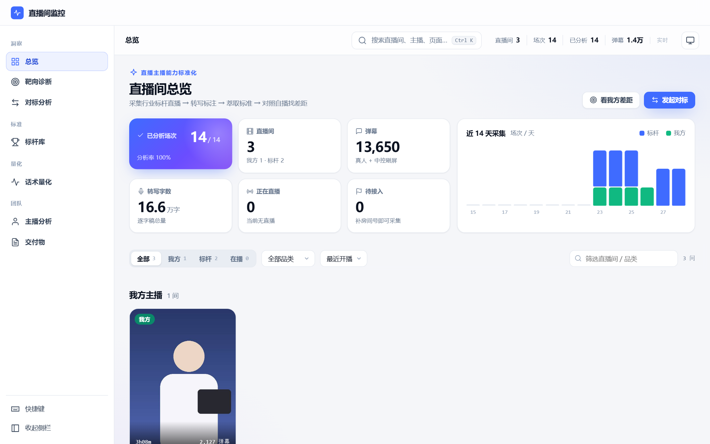
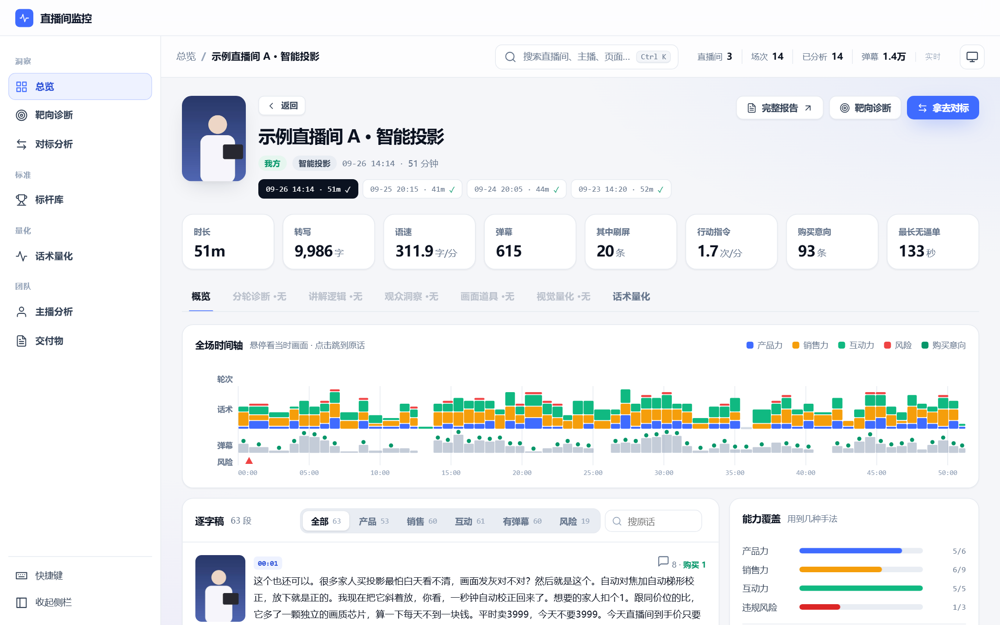
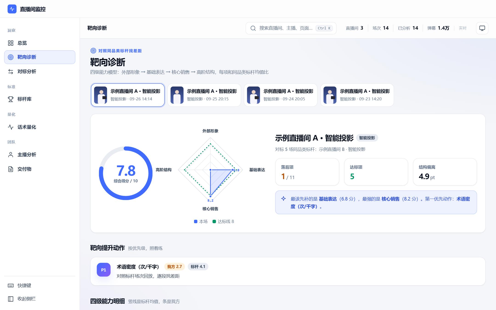
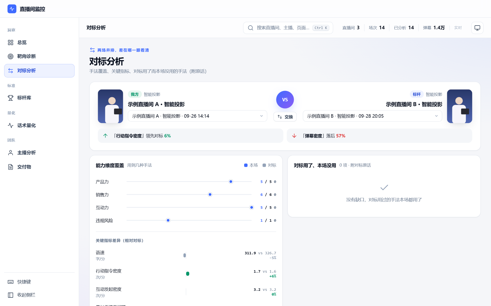
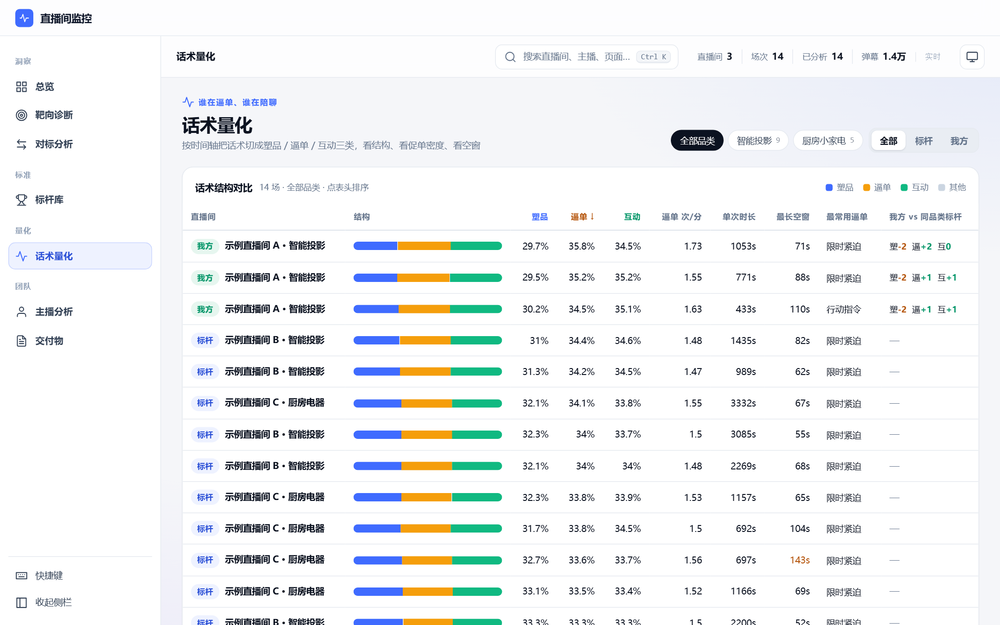
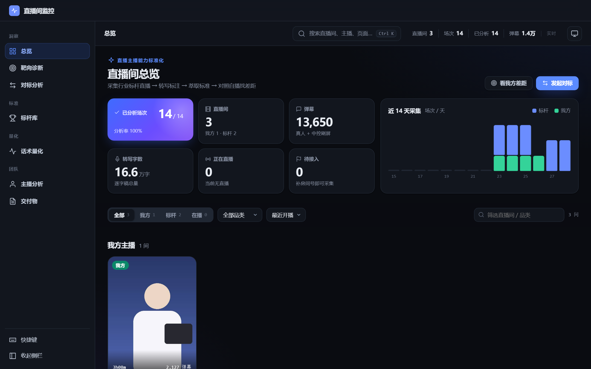

<div align="center">

# 直播话术分析 Agent · Livestream Coach

**让「主播讲得怎么样」变成能对比、能追踪、能练的数字**

简体中文 · [English](README.en.md) · 社区版 v1

</div>



## 它解决什么问题

电商直播团队复盘主播，通常是这样的：

- 回放三四个小时，只能挑着看，**看完也说不清差在哪**；
- 数据平台能告诉你 GMV、流量、转化，**但说不出主播那句话讲得好不好**；
- 竞品直播间人气比你高，**它到底怎么讲的、节奏怎么排的**，没人有时间一场场去听；
- 新主播带教全靠老主播口传，**「多互动」「逼单要狠」**这种话，落不到具体动作上。

这个 Agent 替你盯直播间：**开播自动录，下播自动转写、打标签、算指标**，把每场直播拆成
看得见的结构——塑品讲了多久、逼单讲了多久、多久没提下单、互动发起了几次、观众问了什么没被回应——
再放到同品类标杆旁边比，告诉你**差在哪、先练什么**。

## 优势

| | 人工看回放 | 直播数据平台 | **本项目** |
|---|---|---|---|
| 看什么 | 凭印象 | 流量、GMV、转化 | **主播说了什么、怎么说、节奏如何** |
| 覆盖 | 抽几场、挑片段 | 全量，但只有结果数字 | **全量场次、逐句逐秒** |
| 能不能比 | 很难 | 能比结果，不能比过程 | **同品类标杆逐项对比** |
| 能不能落到练习 | 靠经验 | 不能 | **定位到具体时间点和原话** |
| 成本 | 人力 | 订阅费 | **本地运行；不接大模型也能跑完整链路** |
| 数据归属 | — | 在平台方 | **全部留在你自己的机器上** |

具体来说：

- **讲话术，不讲流量。** 分析对象是主播的每一句话和每一个节奏点，这是数据平台不做的事。
- **零模型成本也能用。** 话术结构、促单空窗、行动指令、弹幕意图全是规则提取；大模型只是加分项，不是前提。
- **转写在本地 CPU。** 不需要显卡，不需要语音识别的 API 密钥，录音不出机器。
- **无人值守。** 登记好直播间，开播自动录、下播自动分析，每天自动体检有没有漏录、漏分析。
- **模型随你换。** 阿里云百炼、DeepSeek、OpenAI、本地 Ollama，或任何兼容 OpenAI 接口的服务，一个向导配好。
- **标准由人定。** 评判标准写在一份 Markdown 里，人审过才进入模型，AI 只执行，不自己给自己定标准。

> 仓库里**不含任何真实直播数据**。截图全部来自 `scripts/demo_data.py` 生成的虚构直播间。

## 看看长什么样

| 场次诊断：全场时间轴 + 逐字稿 | 靶向诊断：四级能力 × 同品类标杆 |
|---|---|
|  |  |
| **对标分析：两场并排** | **话术量化：塑品 / 逼单 / 互动结构** |
|  |  |

支持浅色 / 深色主题（跟随系统）：



## 怎么用：三个典型场景

**场景一：复盘自家昨晚那场。** 打开看板，点进昨晚的场次。时间轴上一眼看到哪一段只在讲参数、
哪一段很久没提下单、弹幕在哪里集中提问；点一下就跳到那句原话。再切到「话术量化」，
看塑品、逼单、互动各占多少，和同品类标杆差多少。

**场景二：盯竞品。** 把竞品直播间登记成「标杆」，它开播就会被自动录下来。
第二天在「对标分析」里把自家和竞品的场次并排放：谁的行动指令更密、谁的促单空窗更短、
标杆用了而你没用的手法是哪些（附原话）。

**场景三：带新主播。** 在「靶向诊断」里选这位主播的场次：四级能力（外部形象 → 基础表达 →
核心销售 → 高阶结构）各打几分、离标杆差多少，系统按差距从大到小列出该先练的项。
一周后再看同一张图，能看到有没有练上去。

## 上手：五步

**第 1 步：安装。** 需要 Python 3.10+ 和 [ffmpeg](https://ffmpeg.org/download.html)（在 PATH 里）。

```bash
git clone <本仓库地址> livestream-coach
cd livestream-coach
pip install -r requirements.txt
python -m playwright install chromium
```

**第 2 步：先用演示数据看一眼**（1 分钟，不需要任何模型和密钥）。

```bash
python scripts/demo_data.py
python scripts/dashboard.py
```

浏览器打开 http://127.0.0.1:8787 ，就是上面截图里的样子。看完删掉：`python scripts/demo_data.py --clean`。

**第 3 步：配置模型。** 向导会一步步问：用哪家大模型（也可以不用）、用哪种转写引擎、模型放哪。

```bash
python scripts/configure.py                     # 交互式向导，写入 config/.env.local
python scripts/setup_models.py --get required   # 下载本地转写模型（约 180MB）
python scripts/configure.py --test              # 测一下大模型服务通不通
```

**第 4 步：登记直播间，先手动录一场。**

```bash
cp config/rooms.example.json config/rooms.json  # 填房间号、我方还是标杆、品类
python scripts/pipeline.py douyin https://live.douyin.com/<房间号> --minutes 60
```

房间号是直播间网址 `live.douyin.com/` 后面那串数字。录完会自动转写和分析，刷新看板就能看到。

**第 5 步：让它无人值守地跑。**

```bash
python scripts/auto_record.py      # 常驻：登记的直播间一开播就录
python scripts/auto_analyze.py     # 常驻：录完自动转写和分析
python scripts/health_check.py     # 体检：有没有漏录、漏分析、静默故障
python scripts/install_services.py # （Windows）把守护设成开机自启
```

## 架构



| 层 | 做什么 | 主要脚本 |
|---|---|---|
| 采集 | 打开公开直播页，录音频、定时截图、抓弹幕和在线人数 | `record.py` `auto_record.py` |
| 转写 | 本地 CPU 转写 + 标点 + 同音纠错 | `transcribe.py` |
| 规则层 | 话术标签、塑品 / 逼单 / 互动结构、促单空窗、弹幕意图 | `analyze.py` `talk_metrics.py` |
| 模型层（可选） | 讲解逻辑、观众关注点、画面呈现 | `deep_analyze.py` |
| 产出 | 本地看板、单场报告、静态站导出 | `dashboard.py` `report.py` `export_site.py` |
| 守护 | 按开播自动录、录完自动分析、产出体检 | `auto_record.py` `auto_analyze.py` `health_check.py` |

## 模型配置接口

所有配置都在 `config/.env.local`（不入库），可以用向导写，也可以照 [`config/.env.example`](config/.env.example) 手写。进程环境变量优先。

**大模型（可选）**：任何兼容 OpenAI Chat Completions 的服务。

| 服务 | `LLM_BASE_URL` | 文本模型 | 视觉模型 |
|---|---|---|---|
| 阿里云百炼 | `https://dashscope.aliyuncs.com/compatible-mode/v1` | `qwen-max` | `qwen-vl-max` |
| DeepSeek | `https://api.deepseek.com/v1` | `deepseek-chat` | —（画面分析自动跳过） |
| OpenAI | `https://api.openai.com/v1` | `gpt-4o` | `gpt-4o` |
| Ollama（本地） | `http://localhost:11434/v1` | `qwen2.5:14b` | `qwen2.5vl:7b` |
| 其它 | 任意 `/v1` 地址 | 自填 | 自填，留空则跳过画面分析 |

```bash
python scripts/configure.py --provider deepseek --key sk-xxx       # 非交互写法，适合部署脚本
python scripts/configure.py --provider custom --base-url http://my-host:8000/v1 --text-model my-model
```

**语音转写**：`ASR_ENGINE`。全库要用同一个引擎，换了之后用 `scripts/retranscribe.py` 全库重转，否则时长类指标会系统性偏移。

| 引擎 | 说明 | 依赖 |
|---|---|---|
| `nano`（默认） | FunASR-Nano，本地 CPU，约 30~40 倍实时 | `setup_models.py --get nano` |
| `local` | faster-whisper，建议有 NVIDIA 显卡 | `pip install faster-whisper` |
| `aliyun` | 阿里云录音识别 | `DASHSCOPE_API_KEY`，`pip install dashscope` |

**本地模型**：`python scripts/setup_models.py` 查看状态，`--get nano|punct|required|all` 下载。
模型可以放在任何地方，用 `NANO_MODEL_DIR` / `PUNCT_MODEL_DIR` 指过去。

## 配置文件

| 文件 | 作用 |
|---|---|
| `config/.env.local` | 模型与密钥（向导生成，不入库） |
| `config/rooms.json` | 直播间登记表（照 `rooms.example.json`） |
| `config/standard.md` | 评判标准模板，按你们的打法填；带【待确认】的条目不会进入模型 |
| `config/taxonomy.json` | 话术与弹幕的标签体系和关键词 |
| `config/asr_fixes.json` | 同音纠错表（正则），改完跑 `scripts/post_all.py --all` |
| `config/anchors.json` | 主播排班（可选，主播分析页用，照 `anchors.example.json`） |
| `config/site.json` | 看板顶栏品牌、嵌入自有平台时的登录态接口（可选，单机不需要） |

## 社区版与专业版

这个仓库是**社区版 v1**：基础链路完整可用。以下能力在专业版中提供：

| 能力 | 社区版 v1 | 专业版 |
|---|---|---|
| 自动采集、本地转写、标点 | ✓ | ✓ |
| 规则层话术量化、看板、报告 | ✓ | ✓ |
| 深度语义分析 | 通用提示词 | 经系统校准的提示词 + 审定版评判标准 |
| 专有名词识别 | 通用 | 针对电商直播调校，准确率更高 |
| 讲解轮次逐轮诊断、画面量化、品类方法论 | — | ✓ |
| 成交与报价追踪 | — | ✓ |
| 我方 vs 竞品的统计判定 | 单场对比 | 多场稳定性判定 |
| 话术评分与经营实绩打通、训练卡、消费者问题手册 | — | ✓ |

有需要请提 Issue。

## 说明与限制

- 主要在 Windows 上开发和长期运行；采集用有头浏览器，Linux 需要桌面环境或 Xvfb。
- 抖音网页结构变化可能让采集失效，`health_check.py` 会报出「弹幕 0 条」这类静默故障。
- 本项目只读取公开直播页上任何观众都能看到的内容。请遵守平台用户协议和当地法律，不要用于侵犯他人权益的用途；采集到的数据留在你自己的机器上（`data/` 不入库）。

## License

[MIT](LICENSE)
